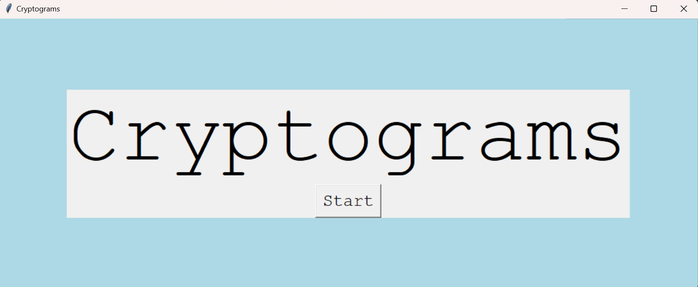
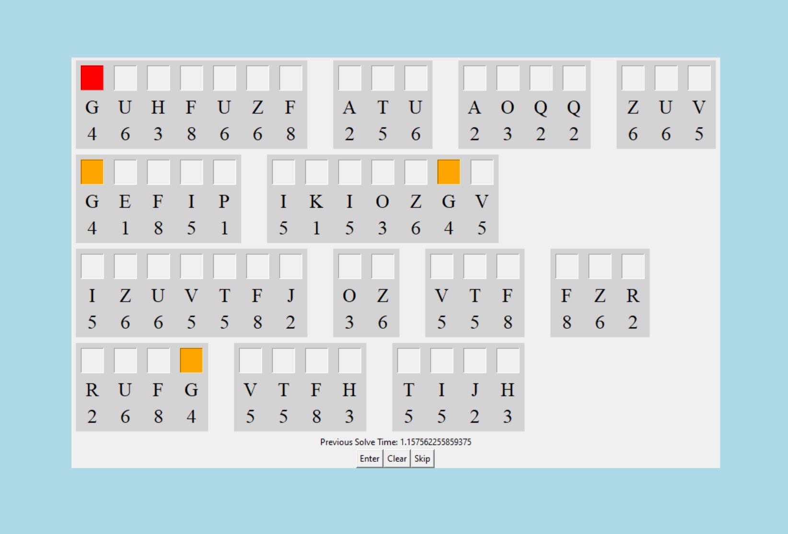

# cryptograms
This is a local cryptogram generator which can be used for manual practice solving. In this case, _**cryptogram**_ refers to a simple substitution cipher.

Although this is mostly just for fun, this tool can be pretty useful for competitors in the Codebusters event for Science Olympiad looking for Aristocrat practice.

## How to Run
Clone the repository and change into the src directory with `cd src` 
Then run the **main.py** file to start the program

## Adding Your Own Quote Bank
The program uses the **quotes.txt** file to draw quotes from, which contains around 70 starter quotes. If you want to pull quotes from your own files, simply edit the **quotes.txt** file to your liking. 

Make sure quotes are not too long, as they get cut off in tkinter (I'll likely fix this sometime later), and do not include any punctuation. Each quote should be entirely on a single line.

# Notes
This tool isn't necessarily finished, although it is functional. Some new features may be added in the future. If you have suggestions or want to help, let me know!
